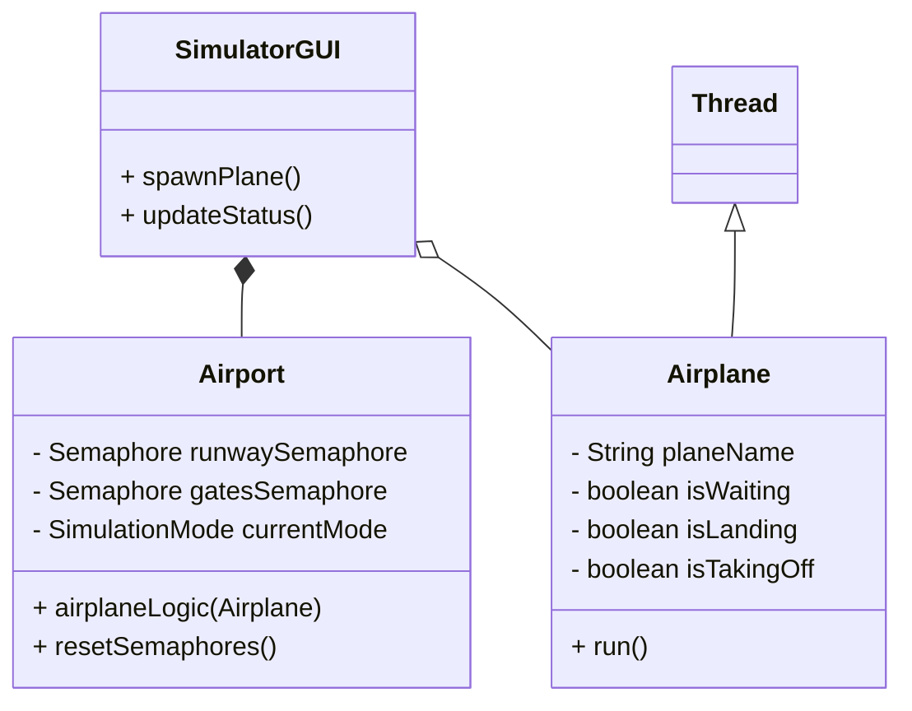
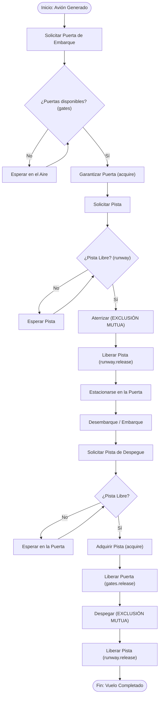
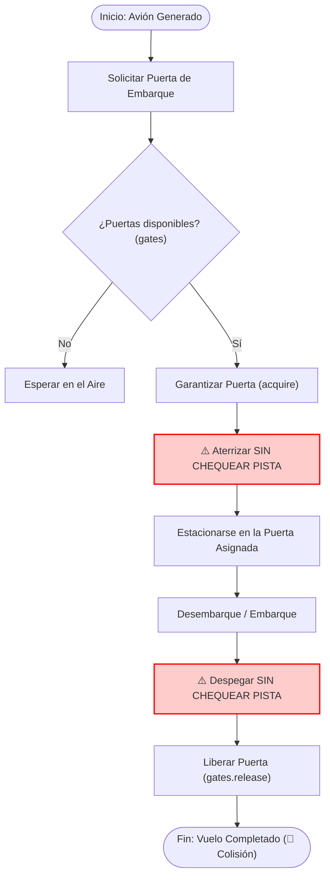
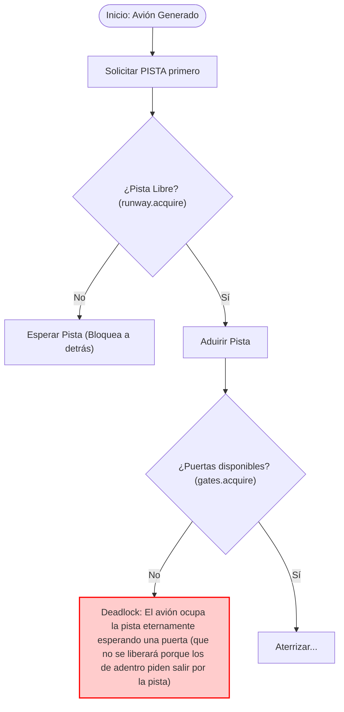

# Presentación del Proyecto: Simulación de Aeropuerto Inteligente

## 1. Código Fuente Completo

El proyecto está implementado en Java utilizando principios de la programación concurrente (hilos) y la interfaz gráfica de `Swing`. Los archivos principales incluyen:

- `Airport.java`: Controla la lógica y algoritmo de sincronización con sus diferentes Modos de Simulación.
- `Airplane.java`: Extiende `Thread`. Representa cada avión que opera de forma concurrente, actuando como un hilo independiente en la JVM.
- `SimulatorGUI.java`: Gestiona los controles principales y permite visualizar qué hilos (aviones) están en qué estado.
- `AirportPanel.java`: Animación bidimensional de la pista y las terminales.

---

## 2. Documentación Detallada

### Diseño del Sistema

A continuación se ilustra la arquitectura de clases principal y el flujo secuencial seguro de cada avión (hilo):

**Diagrama de Clases UML Simplificado**

**Diagrama de Flujo del Vuelo (Modo Seguro)**

### Explicación de Semáforos, Exclusión Mutua y Sincronización

El Aeropuerto simula 1 Pista y 3 Puertas. Para el manejo seguro de concurrencia se instancian semáforos del paquete `java.util.concurrent`:

- **Exclusión Mutua (`runwaySemaphore`)**: Se inicializa su permiso en 1 (`new Semaphore(1, true)`). La pista de aterrizaje es tratada como un **recurso crítico de acceso exclusivo**. Sólo puede operar un avión a la vez allí para evadir catástrofes; el atributo `true` indica una política justa tipo *FIFO (First-In, First-Out)* para evitar que ciertos procesos sufran de "inanición".
- **Sincronización Computada (`gatesSemaphore`)**: Se inicializa en 3 (`new Semaphore(3, true)`). Opera como un regulador o coordinador, bloqueando el acceso una vez agotados sus 3 permisos y despertando los hilos cuando un avión sale de su estadía, asegurando control absoluto del espacio finito.

### Ejemplos de Condiciones de Carrera y Cómo Fueron Resueltas

- **Condición de Carrera Simulada (`logicRaceCondition`)**: Existe un modo demostrativo en el código donde intencionalmente el avión omite llamar la adquisición del candado de la pista (`runwaySemaphore.acquire()`). El resultado es una evidente e inmediata colisión y mezcla de estados no deterministas entre los distintos hilos al manipular datos y acciones de forma entretejida en zonas mutuamente excluyentes.

**Diagrama: Flujo del error en Condición de Carrera**

- **Simulación de Deadlock (`logicDeadlock`)**: El código se altera para obligar al hilo a pedir primero el medio exclusivo temporal (La Pista) antes que el destino múltiple (La Puerta). Esto viola el principio de jerarquía de Lock de recursos (Hold and Wait).

**Diagrama: Flujo hacia del (Deadlock)**

- **Resolución General**: Obligando a las rutinas de aterrizaje y despegue a pasar por el `runwaySemaphore` y manteniendo la secuencia rígida (Puerta -> Pista para llegar, Pista -> liberar Puerta para irse). Dicho semáforo impone que una vez un subproceso tome el relevo, cualquier paralelismo asíncrono que intercepte dicha lógica entrará en estado de "suspensión" hasta recibir una señal limpia de `release()`.

## 3. Conclusiones

**Análisis de los problemas encontrados y resoluciones**:

1. **Anarquía por Concurrencia (Race Condition)**: Sin el semáforo binario o mutex, el entrelazamiento impredecible del CPU corrompe el orden biológico del aeropuerto. Este problema se remedia bloqueando completamente el acceso por exclusión mutua durante el momento atómico que toma el despegar y aterrizar.
2. **Abrazos Mortales Multi-Recurso (Deadlocks)**: En el método `logicDeadlock()`, se altera adrede la asignación. Si el avión en su despegue pide la **Pista** primero en lugar de asegurar la **Puerta**, y las puertas están llenas de aviones trancados intentando usar la pista para salir; ocurre un Deadlock o *bloqueo mutuo circular*.
3. **Resolución de Deadlocks**: Aplicamos la estrategia universal orientada a grafos de solicitar recursos críticos secuencialmente (Evitar retención circular). Se pide primero el recurso multiplicativo de destino (Puertas) antes de ocupar la llave paso de exclusión (Pista). Ocurra lo que ocurra, la pista jamás actuará como tapón para aviones carentes de capacidad terminal.

## 4. Reflexión y Relación con Sistemas Operativos

Este simulador no es muy distinto a los paradigmas arquitectónicos ocultos en un kernel moderno de un Sistema Operativo moderno:

- **Interfaces I/O (Entrada / Salida)**: La `Pista` en nuestro proyecto opera un rol idéntico a una impresora en una red local instalada, la placa de red de una PC o los ciclos de reloj para E/S del bus de memoria — Operaciones seriales puras; exigen la protección atenuante de una condición de carrera, con un cerrojo exclusivo (`Mutex`).
- **Páginas de Memoria (RAM) y Buffers**: Las `Puertas` actúan de forma equiparable a una limitación natural en sistemas. Por ejemplo: una cuota de buffers disponibles para un driver de audio o cuadros de paginación en RAM. Se admiten ciertos procesos concurrentes concurrentes paralelos, pero si se desborda, los procesos van a una "Tabla de Suspensión".
- **Planificación (Scheduling) o Dispatching**: En el código especificamos semáforos de un modelo `Fair (True)`. Esto previene uno de los problemas históricos del algoritmo de Shortest-Job-First (Inanición o Starvation). Nos emuló a un Planificador `First-Come First-Served (FCFS)` al tratar con equidad a los primeros hilos en invocar las llamadas al sistema.
